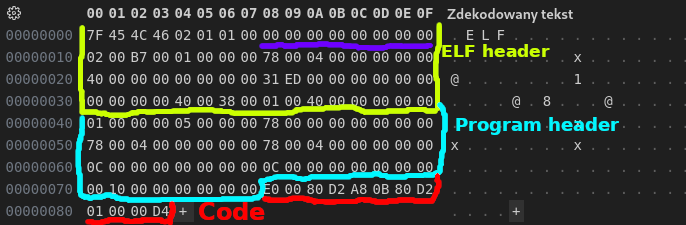
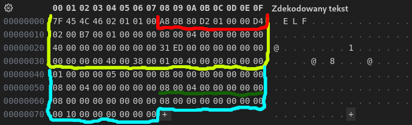
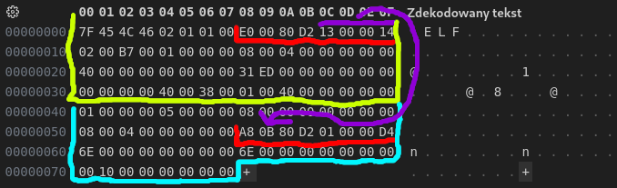
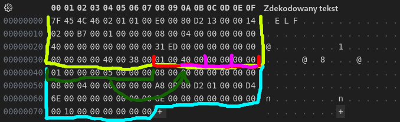
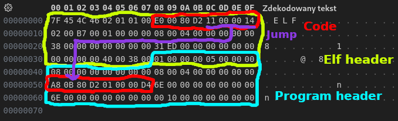

# linux executable generator (arm64)
### and how i generated the smalled possible one

this one is kind of simple

if i want to write a self-hosted language i need to be able to generate executable
i won't be targeting anything other than arm64 linux
(any time soon)

because 
i doubt anyone would care about yet another languege
so this i meant to be something i would enjoy writing in
and i don't use windows anymore

this means all we need to worry about is elf "Executable and Linkable Format"
the bad new is it isn't really that well documented in many place (see sources at the bottom)
while the executable part (we will focus on today) is fairly straight forward

i will need some time to figure out generation of actual objects

### what an executable elf file needs

in order to have a working elf file we need
-  [an elf header](https://refspecs.linuxbase.org/elf/gabi4+/ch4.eheader.html), which says
    - what our elf file is (executable/library/...)
    - what architecture it's targeting
    - where the execution should start
    - where other headers are in the memory

- [program header](https://refspecs.linuxbase.org/elf/gabi4+/ch5.pheader.html#p_type), which specifies 
    - the segment that will be loaded into the memory
    - position/length of it
    - the permissions it will have

in elf there are also sections headers but these are more relevant
when we talk about libraries or object files
and are not required for the executable

### how will we generate one
there are 3 problems

**0. we have to predict the size of the file**

this one is self explanitory

while it wouldn't be an issue if we were writing it in stream directly

it would introduce more issues, we needed to have it somewhere in memory

**solution**

our own class
```cpp
class sraw
{ // stream resolver and writer
public:
    uint64_t capacity = 1;
    uint8_t *data = (uint8_t *)malloc(1);
    uint64_t pointer = 0; // defacto size
    std::map<std::string, std::vector<uint64_t>> ???;//secret for now
...
}
```
just malloc it

everytime we don't have enough spece we just double it
```cpp
void bump()
{
    capacity <<= 1;
    data = (uint8_t *)realloc(data, capacity);
}
```

i could have used vector but this would cause an issue with
the next problem

**1. diffrent sizes of data**

some values in the elf file are
- 8bit : magic number + ELF in ascii
- 16bit : table sizes
- 32bit : instructions
- 64bit : adresses and offsets

**solution**

lets just reintepret the data pointer as pointer to the type we want
```cpp
sraw &operator<<(uint64_t v)
{
    int64_t req = 8;
    ...//ittrelevant
    *((uint64_t *)(data + pointer)) = v;

    pointer += req;

    return *this;
}
```
i'm sure all this pointer stuff could make a rust dev cry but it works :3

but this way we can just
```cpp
sraw elf;
elf << (uint8_t)0x7F << 'E' << 'L' << 'F';
```
to write a begining of the elf file

**2. need to predict the future**

the thing with elf file is that it requires us to specify in the file
things that are supposed to be written there in the future

like offest to some other header further down the file

**soulution**

now this one was simple just make promises
```cpp
std::map<std::string, std::vector<uint64_t>> promises;
void promise(byte_size size, std::string name)
{
    ...//irrelevant
    promises[name].push_back(pointer);

    pointer += size;
}
```
we just declare that in the future we will fill up that part in memory

and when the time comes
we resolve our promise
```cpp
elf.resolve(elf.pointer,"code_section");
for(int i = 0;i<code.size();i++){
    elf << code[i];
}
```

like this

```cpp
void resolve(uint64_t value, std::string name)
{
    ...//some checks

    for(uint64_t place : promises[name]){
        *((uint64_t *)(data + place)) = value;
    }

    promises[name].clear();
}
```

after all this we were able to generate

### **the smallest** arm64 executable (that doesn't segfaults)
```testme```
132 bytes ✨
generated by ```elfgen.cpp```



it has
- elf header (yellow)
- program header (blue)
- code (red)
```
movz     x0, #7
movz     w8, #93//exit
svc     #0
```
it basicaly exits with exit code 7

### well technically we can get even smaller
you might wander how? what the purple color there is?

it's "Unused/padding" so in theory if we ommit the instruction specifying the exit code ```movz     x0, #7``` 

to make it fit inside 8 bytes

we should be able

to make it 12 smaller (120 bytes)
```realmin``` generated by (```elfgen-smaller.cpp```)



again
- elf header (yellow)
- program header (blue)
- code (red)
```
movz     w8, #93//exit
svc     #0
```

### yet we can even improve this

you probably can already assume we can take advantage of the green thing

but what is this?

it's part of program header

to be specyfic "Reserved for segment's physical address"

which isn't relevant for linux (and is used in embeded devices based on my knowledge)

what can we do with it?

since all arm64  are 32 bit

we can fit total of 4 instructions in these 2 fields

so

if we jump from the end of first segment to the next one
we get a total of 3 instructions
just enough to exite with the exit code of our choice



i've marked the jump with purple color
still
- elf header (yellow)
- program header (blue)
- code (red)

now we can actually specify the exit code
```
# ./realmin-improved
# echo $?
7
```

and this is great
we got 120 byte 🔥 file which is the smallest possible

elf file that has program header 

(which is required to put stuff in memory)

and we are able to specify the exit code

### but can we go even further?

i'm going to regret this rabit hole ... yes

but we **will have to make the headers overlap**

here is the idea



the elf file format doesn't forbid headers overlaping and we can take advantage of that

let's not worry about the code placement for now
we have
- elf header (yellow)
- program header (blue)

and the green section we can in theory put in the place of red one
how/why?

let's start by explaining what this fields are

**(important)**
- number of program headers (red)

**(we can ignore :3)**
- size of section header entry (pink 0)
- number of section header entries (pink 1)
- index of string sections (pink 2)

so this only works because the important part matches the begining of program header we can overlap them without any issues

#### you might be wandering what about the stuff "we can ignore :3"

simple the section headers are not really relevant for the executables (unless we talk dynamic linking)
so we can liturary set it to whatever we want and it won't cause any issues



```truemin``` only 112 bytes 🎉
generated by ```elfgen-smallest-improved.cpp```
```
# ./truemin
# echo $?
7
```

i don't think you can go smaller
you would have to overlap so many diffrent variables it would be crazy 👻

### some size comparison of the same program
- c/c++ (70360 bytes) + striped (67592 bytes)
```cpp
int main(){
    return 7;
}
```
- assembly (848 bytes) + striped (344 bytes)
```assembly
.globl _start
_start:
    movz     x0, #7
    movz     w8, #93//exit
    svc     #0
```
- my small binary (132 bytes)
- my smallest + improved binary (120 bytes)
- my true smallest (112 bytes)

### in short


i think this little detour was a success

112 bytes is the smallest possible linux arm64 executable

if you go any smaller pls let me know ❤️

all the code is available in this directory
and all the binaries are inside ```bin``` subfolder


## back to the main project

after somewhat mastering the art of crafting an elf executable

the next step for me will be to be able to generate an object file

but that's something for the next time

source:

- elf header docs : https://refspecs.linuxbase.org/elf/gabi4+/ch4.eheader.html
- program header docs : https://refspecs.linuxbase.org/elf/gabi4+/ch5.pheader.html#p_type
- osdev elf doces : https://wiki.osdev.org/ELF

feel free to use any of this
- code : MIT
- write up : public domain
- images : CC0
still credit appreciated :3